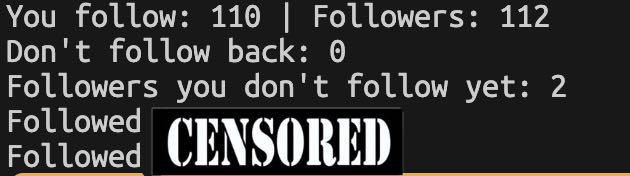

# GitHub Follow Manager

A simple Python script that uses the GitHub API to help manage follow relationships. It can unfollow users who no longer follow you back and follow back users who started following you.

### What it does
- Checks your GitHub followers and following lists
- Identifies users you follow who no longer follow you back
- Identifies users who follow you but you are not following back
- Lets you clean up one-sided follows
- Lets you quickly reciprocate new followers

### Why
- Built as a small automation project for keeping GitHub follow relationships tidy
- Useful if you need a workflow that does the micromanaging for you
- Keeps the project simple and focused on one job

### Dependencies
- Confirmed working on `python 3.12.3`
- Likely works in other versions due to simplicity

### Setup
1. Create a `.env` file in the project root
2. Add your GitHub credentials:
    - `GITHUB_USERNAME=your_username`
    - `GITHUB_TOKEN=your_token`
3. Install dependencies with `pip install --no-cache-dir -r requirements.txt`

### Run
- `python github_follow_sorter.py`

### Screenshot

### Future Improvements
- Add dry-run mode before making changes