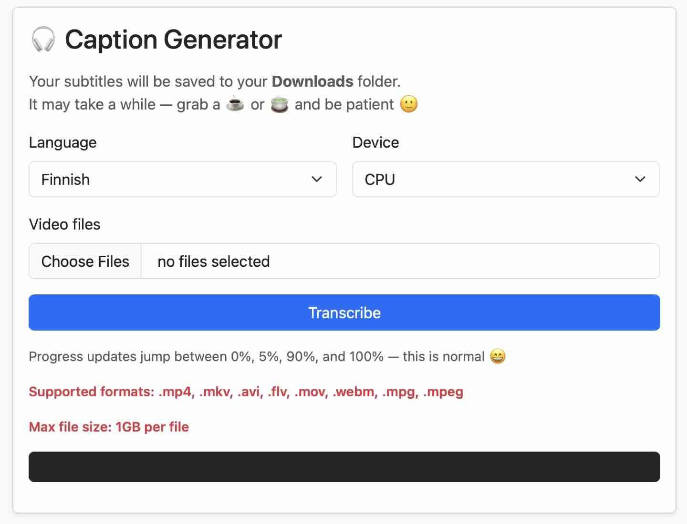

# Caption Generator

A simple caption-generation API built with FastAPI and faster-whisper. It serves a lightweight web UI at the root, accepts video uploads, extracts audio with ffmpeg, and generates subtitle output by transcribing the audio with a Whisper model.

### What it does
- Serves a simple index.html interface at the API root
- Accepts video uploads through the UI and sends them to /transcribe
- Extracts mono 16kHz audio from supported video formats using ffmpeg
- Transcribes audio with faster-whisper
- Returns captions in SRT format
- Supports language selection or autodetection
- Uses request-logging middleware
- Reuses loaded Whisper models to avoid repeated model initialization
- Automatically unloads idle models after a short timeout to free memory
- Supports both CPU and CUDA execution
- Supports batch uploads

### Why
- Built as a compact captioning tool for quickly turning video into subtitles
- Keeps the workflow simple: upload video, transcribe, get captions
- Designed to balance simplicity with better performance through model caching
- Useful as a small self-hosted transcription service with a minimal browser UI

### Dependencies
- Docker
- Nvidia GPU Support for CUDA mode (or CPU mode without it)
- Your Huggingface token
- See `requirements.txt`

### Setup
1. Create a .env file in the project root
2. Add your Hugging Face token:
    - HF_TOKEN=your_token
3. Make sure Docker is installed
5. Build the image: `docker build -t your_image .`

### Run
```bash
docker run --gpus all \
    --name cap-gen \
    --env-file .env \
    -d -p 8000:8000 \
    your_image
```

### Screenshot


### Future Improvements
- Add basic auth or API key protection for serviceability