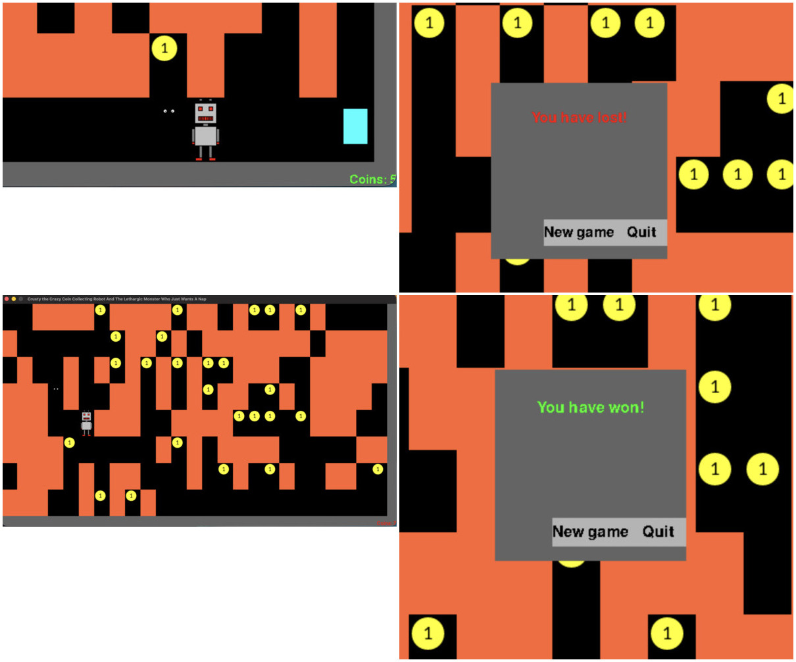

# Robot

A simple 2D grid-based game built with pygame where you control a robot, collect coins, and try to survive a relentless monster.

### What it does
- Move a robot across a 2D map using arrow keys
- Collect coins to complete the level
- Allows collecting more coins than required (optional challenge)
- A monster appears after a set number of turns (based on difficulty)
- Every player move triggers a monster move (turn-based pressure)
- Avoid the monster while gathering enough coins to win
- Score keeping, reset

### Why
- Built as a small project to explore game mechanics and UI design with pygame with:
- BFS-based monster chasing logic
- Grid-based map generation
- And to keep things minimal and fun while still challenging
- Also as a class assignment

### Dependencies
- `python <= 3.13` for `homebrew`

### Setup
1. Fork this repo
2. `pip install --no-cache-dir -r requirements.txt`

### Run
- `python main.py`

### Screenshot

### Future Improvements
- Difficulty selection UI
- Monster behavior fix
- Level progression
- Leaderboard