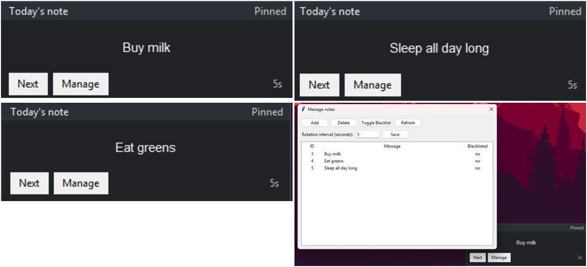

# Silly Notes

A tiny Python desktop widget that displays a rotating user-defined messages from an SQLite database.

### What it does
- Create, edit, delete notes
- Configurable rotation interval
- Blacklist notes from rotation
- Config menu and context menu
- Lightweight, local-first

### Why
Built for fast iteration practice and personal use. Kept intentionally small to focus on shipping.

### Run

```bash
cd sillynotes
python -m venv .venv
source .venv/bin/activate
pip install -e .[dev]
python -m silly.main
```

### Tests

```bash
pytest
```

### Screenshot
