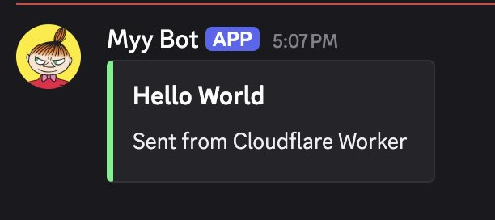

# Webhook Bot

A lightweight Discord webhook relay built with pure JavaScript and hosted on Cloudflare Workers. It accepts authenticated POST requests and forwards JSON payloads directly to a Discord channel via webhook.

### What it does
- Accepts incoming POST requests with JSON payloads
- Authenticates requests using an x-api-key header
- Relays messages to a Discord channel via webhook
- Runs on Cloudflare Workers (serverless, fast, globally distributed)
- Minimal, dependency-free JavaScript implementation

### Why
Built for simple, fast, and secure message relaying without needing a full backend server. Ideal for lightweight integrations, automation, or notifications.

### Setup
1. Fork this repo
2. Create a Cloudflare Worker with `your_forked_repo/webhook-bot` specified
3. Add the following environment variables (secrets) for the worker:
    - DISCORD_WEBHOOK_URL – your Discord webhook URL
    - API_KEY – a secure key used to authenticate incoming requests
4. Deploy the worker

### Run
1. Check your worker url. It looks like `https://webhook-bot.(your_account).workers.dev`
2. Payload contract is as follows:
```json
{
    "message": "String value"
}
OR
{
    "message": {
        "embeds": {
            // discord formated string
        }
    }
}
```
3. Do the following in shell

```bash
curl -X POST <your_worker_url> \
    -H 'x-api-key: <your_api_key>' \
    -H 'content-type: application/json' \
    -d '<your_payload>'
```
OR do this with Postman

### Screenshot


### Future Improvements
- Use modern conventions like `Authorization: Bearer xx` instead of `x-api-key`
- Normalize payload before sending
- GitHub integration for workflows